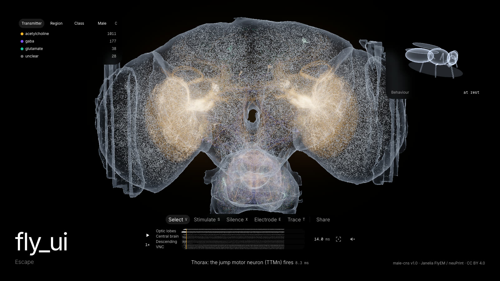
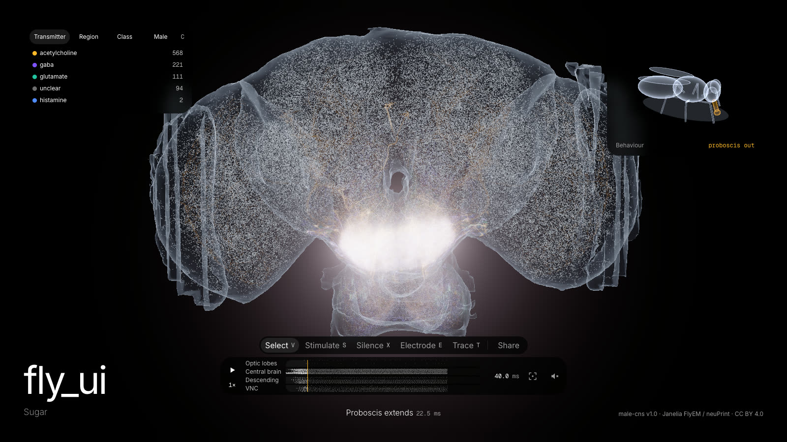
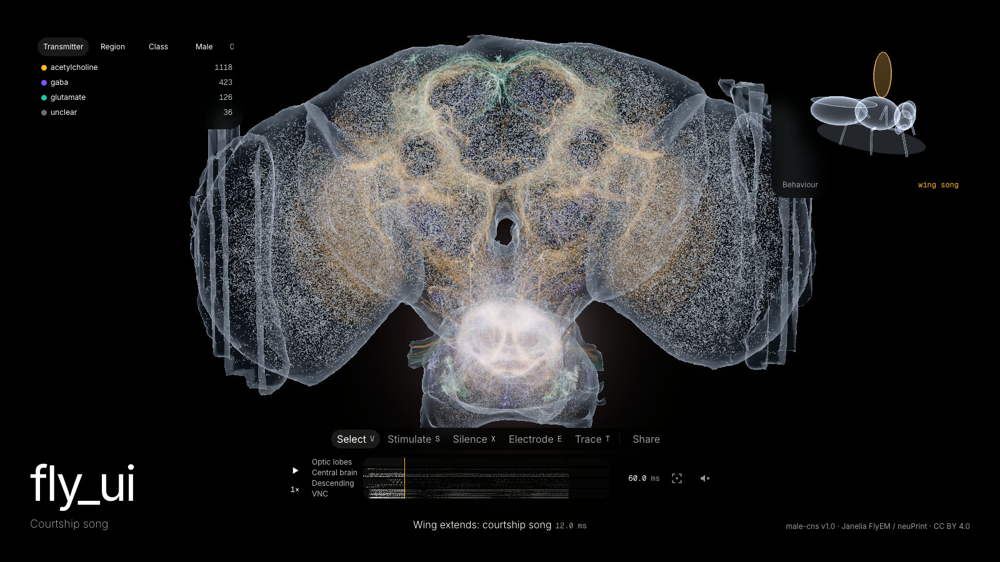
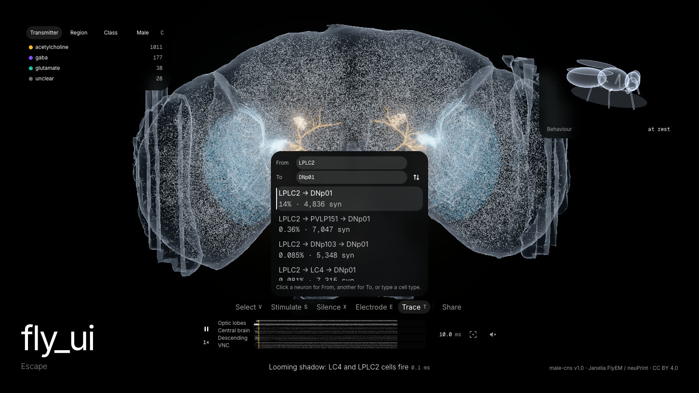

# Мозг мухи в браузере: 176 тысяч нейронов, WebGPU и спайковая модель на TypeScript

*Черновик для Хабра. Картинки — `docs/media/*` и кадры из `snaps/`, загрузить при публикации.*



Janelia FlyEM выложила полный коннектом центральной нервной системы самца дрозофилы: мозг и брюшная нервная цепочка, 176 тысяч нейронов, десятки миллионов синапсов, лицензия CC BY. Это не модель и не атлас — это карта реальной проводки конкретной мухи, восстановленная из электронной микроскопии.

Я хотел эту карту *потрогать*. Не посмотреть на картинку из статьи, а поставить электрод, подать стимул, выключить нейрон и увидеть, перестанет ли муха прыгать. В итоге получился [fly_ui](https://tonywkx.github.io/fly_ui/) — статический сайт, который рисует коннектом в 3D как стенд электрофизиолога и гоняет по нему спайковую модель всего мозга. Ниже — как он устроен: данные, симуляция, рендер и то, как я проверял визуал без глаз.

[видео 43 с: snaps/fly_ui.web.mp4]

## Что можно сделать

Три сценария, каждый — 300 мс модели на **всём** графе:

- **Побег.** Надвигающаяся тень возбуждает зрительные нейроны LC4 и LPLC2, через несколько миллисекунд срабатывает Гигантское волокно (DNp01), сигнал уходит в грудной отдел к мотонейрону прыжка TTMn — муха взлетает примерно на 30-й миллисекунде.
- **Сахар.** Вкусовые нейроны → подглоточная зона → мотонейрон MN9 → хоботок вытягивается.
- **Ухаживание.** Самцовые нейроны P1 → pIP10 → ритм-генераторы в брюшной цепочке → крыловые мотонейроны → «песня» (её можно включить звуком).





И инструменты: стимулировать (кликом или кистью, как оптогенетикой), заглушить нейрон, поставить до четырёх электродов с потенциалом в реальном времени, найти самые сильные пути между двумя типами клеток. Весь эксперимент кодируется в URL — можно отправить ссылку «я заглушил Гигантское волокно, и муха не прыгнула».

Поведение мухи нигде не заскриптовано: прыжок — это порог частоты мотонейронов TTMn, хоботок — MN9, взмахи крыльев — спайки крыловых мотонейронов. Если заглушить нужный нейрон, муха действительно перестаёт прыгать: пик частоты TTMn падает с ≈290 Гц до ≈120–180 Гц и не дотягивает до порога.

## Стек и ограничения

Я поставил себе жёсткие рамки:

- **Никакого бэкенда.** Только GitHub Pages.
- **≤ 15 МБ до первого кадра**, остальное — лениво.
- **60 fps** на MacBook с M-чипом.
- **Только TypeScript** — и пайплайн данных, и симуляция, и фронт. Без Python, без Brian2.

Монорепо на pnpm: `apps/pipeline` (Node-скрипты, которые качают и запекают данные), `packages/data` (бинарный формат, общий для пайплайна и фронта), `packages/sim` (симулятор), `apps/web` (Vite, React 19, MobX, three.js WebGPURenderer + TSL, Tailwind v4).

## Данные: из neuPrint в 15 мегабайт

Сырьё лежит в трёх местах: [neuPrint](https://neuprint.janelia.org) (графовая база, Cypher поверх HTTP), публичный бакет с Feather-таблицами (аннотации тел, нейромедиаторы и веса связей — последний файл весит 1,1 ГБ) и скелеты нейронов в SWC.

Пайплайн — цепочка Node-скриптов:

1. **scout** — Cypher-запросы, которые для каждого сценария находят «ядро» (опорные типы: LC4, LPLC2, DNp01, TTMn…) и «расширение» (типы с суммарным весом ≥ N синапсов к ключевым хабам). Порог свой для каждой цепи, потому что плотность разная: побег — 1254 нейрона, сахар — 945, песня — 1703.
2. **pull** — скелеты по HTTP, кэш на диске (≈ 400 МБ сырого SWC на 3600 тел).
3. **cloud / neuropil / graph** — облако точек, меши нейропилей и полный граф связей.
4. **bake** — всё это в бинарные чанки + `manifest.json`.

Пара вещей, на которые я наступил:

- Координаты в SWC male-cns — это **воксели по 8 нм**, а не нанометры. Мозг получался в восемь раз меньше ожидаемого, пока я не сверил bbox с реальными размерами (≈ 0,73 × 0,52 × 1,0 мм).
- Эндпоинт скелетов отдаёт 403, если имя датасета закодировать в URL (`male-cns%3Av1.0`). Нужно отправлять как есть.

### Свой бинарный формат

Сначала была идея взять DuckDB-WASM и гонять SQL прямо в браузере. Отказался: он сам весит больше, чем весь бюджет. Вместо этого — простой контейнер `FLYD`: 16-байтный заголовок, таблица секций по 12 байт, little-endian, выравнивание на 4 байта, только типы до 4 байт (никакого Float64). Схема манифеста — zod, `formatVersion` должна совпасть точно, иначе фронт просит перепечь данные.

Что внутри:

- **Скелеты**: координаты квантованы в u16 по общему bbox, радиус — u16, родитель — локальный i32. Неразветвлённые участки упрощены Рамером — Дугласом — Пекером с ε = 1 мкм, точки ветвления и листья сохраняются всегда.
- **Граф**: CSR, исходящие рёбра, номера колонок дельта-кодированы внутри строки, вес — u16 (число синапсов). Знак хранится **на нейроне**, а не на ребре (принцип Дейла): ACh возбуждает, GABA, глутамат и гистамин тормозят, неуверенный прогноз медиатора — ноль.
- **Облако**: 2,16 млн точек, равномерно по длине кабеля 5000 случайных нейронов, разложены в непересекающиеся уровни 200k / 600k / 1,2M. Первый уровень (1,1 МБ) идёт в первый кадр, остальные догружаются.
- **Спайки**: запечённый прогон каждого сценария, биннинг по времени в CSR-формате — 0,06 МБ на сценарий.

В первый кадр попадают оболочки нейропилей, первый уровень облака, графы всех сценариев и скелеты только выбранного. Итог — 10,6 / 11,7 / 12,5 МБ для трёх сценариев. Декодирование всегда в пуле воркеров через comlink.

## Симуляция: LIF на всём мозге

За основу взята модель [Shiu et al., Nature 2024](https://doi.org/10.1038/s41586-024-07763-9) — та самая, которая на коннектоме FlyWire предсказала, какие нейроны участвуют во вкусовом поведении. Leaky integrate-and-fire с проводимостью:

```
dv/dt = (v₀ − v + g) / τm,   dg/dt = −g / τsyn
v₀ = −52 мВ, v_th = −45 мВ, τm = 20 мс, τsyn = 5 мс,
рефрактерность 2,2 мс, задержка 1,8 мс, вес = 0,275 мВ × синапсы × знак
```

Связи — все пары с ≥ 5 синапсами: ≈ 7 млн из 28 млн, ≈ 73 % синапсов. Это та же отсечка, что у Shiu.

Наивный шаг по всем 176 тыс. нейронов каждые 0,1 мс — это 1,76 млрд обновлений на секунду модели. Но в любой момент активна малая доля сети, поэтому:

- **Точный экспоненциальный шаг.** Пара (v, g) линейна, её можно проинтегрировать аналитически на фиксированном dt = 0,1 мс. Чистый event-driven не подходит: момент пересечения порога не имеет замкнутой формы.
- **Только активное множество.** Интегрируются нейроны, у которых |v − v₀| или |g| больше 1e-4 мВ или идёт рефрактерность; остальные «защёлкиваются» в покой.
- **Кольцевой буфер задержек.** Задержка одинаковая, поэтому вместо очереди с приоритетом — FIFO из (шаг, пресинапс).
- **Float64 для v и g.** На Float32 экспонента застревала около −52 мВ и нейроны не успокаивались — активное множество не уменьшалось.

Пуассоновская стимуляция повторяет `PoissonInput` из Brian2. Детерминизм — генератор `mulberry32(seed)` передаётся в движок снаружи, один бросок на стимулируемый нейрон за шаг независимо от его состояния, чтобы поток случайных чисел не зависел от динамики.

Один прогон сценария на всём графе — ≈ 3,5 с в Node. Тот же код работает в воркере в браузере: режим `?sim=live` подгружает полный граф и считает вживую, а спайки передаются в основной поток пачками по 20 мс через transferable — без SharedArrayBuffer, потому что на GitHub Pages нельзя выставить COOP/COEP.

### Где модель не сошлась с биологией

- **Гигантское волокно.** DNp01 связан с мотонейроном прыжка электрическим синапсом, а электрических синапсов в EM-данных нет. Химически знак DNp01 → TTMn оказался нулевым, и муха не прыгала. Решение — явные overrides: вес существующих рёбер DNp01 → TTMn/PSI выставляется в 40 мВ, этого хватает, чтобы перебить торможение TTMn.
- **Сахар.** В male-cns нет типов Gr5a/Gr64f, по которым стимулирует Shiu. Первая попытка — стимулировать все BM_Taste — дала тишину на MN9: это механосенсоры. Сработали LB3a–d (77 вкусовых клеток с самым сильным функциональным путём к MN9). Что это именно сахарные рецепторы — не проверено, и в приложении это так и написано.

Такие вещи ловят отдельные «биологические» тесты (`pnpm test:bio`): «стимул LC4+LPLC2 → TTMn пересекает порог», «заглушили DNp01 → не пересекает» и т. д. Они идут на полном графе ≈ 20 с и не входят в обычный прогон.

## Рендер: WebGPU, ленточки и волна в шейдере

Сцена — ванильный three.js с `WebGPURenderer` и шейдерами на TSL; react-three-fiber я сознательно не брал: кадровый цикл живёт вне React, а сцена подписывается на MobX через `reaction`. Тот же TSL-код компилируется в WGSL или GLSL, поэтому фолбэк на WebGL2 достался почти бесплатно — я прогнал все сценарии и инструменты на обоих бэкендах и сравнил скриншоты.

**Нейроны.** Каждый сегмент скелета — инстанс экранно-ориентированного квада (не `Line2`), аддитивное смешивание без записи в глубину. На сценарий это ≈ 600 тыс. сегментов. Состояние нейрона (активность, подсветка, цвет) хранится не в буфере сегментов, а в текстурах, адресуемых номером строки нейрона: переключение режима окраски — это запись в текстуру, а не перекомпиляция шейдера.

**Волна.** Симулятор пишет только одно число на нейрон — время последнего спайка — в R32F-текстуру. Вершинный шейдер берёт возраст спайка, умножает на скорость и сравнивает с расстоянием сегмента от сомы по дереву: фронт бежит от сомы к окончаниям. Яркие фронты — в HDR выше 1, на них срабатывает bloom; всё вместе тонируется AgX.

**Пыль и оболочки.** Облако точек даёт силуэт всей ЦНС, полупрозрачные меши нейропилей — «стекло». На интро пыль собирается в силуэт, пока догружаются данные, затем камера ныряет к рабочему ракурсу.

**Пикинг.** Отдельная сцена рисует id нейронов в RGBA8, читается окно 9 × 9 пикселей под курсором, выбирается ближайшее попадание к центру. Перерисовка — только когда двигается курсор или камера. Никакого CPU-рейкастинга по сотням тысяч сегментов.

**Режиссёр.** Камера на GSAP следит за «фронтом активности» — центром и радиусом недавних спайков — и медленно крутится вокруг мозга. Любое касание орбиты возвращает управление пользователю.

Что оказалось дорогим, по профайлеру:

- MSAA — самое дорогое из всего, выключен на всех пресетах.
- `backdrop-blur` у полупрозрачных панелей HUD — ≈ 6 fps, потому что каждую рамку перефильтровывает живой канвас. На низком пресете блюр выключается, панели становятся плотнее.
- Плотная пыль: +900 тыс. спрайтов вдвое роняют fps на M4 независимо от разрешения — упирается в количество примитивов. Пока ограничился первым уровнем облака, это в бэклоге.

Если fps держится ниже 54, `FpsGuard` сам понижает качество.

## Интерфейс как прибор

Визуальная идея — «электрофизиологический стенд встречается с моушн-дизайном»: чёрная сцена, светящиеся нейроны, внизу таймлайн с растром спайков по регионам (зрительные доли, центральный мозг, нисходящие, брюшная цепочка), как в видеоредакторе. Цвета нейромедиаторов: возбуждающий ацетилхолин — тёплый, тормозные GABA и глутамат — холодные.

Несколько решений, которые стоили времени:

- **Электроды** не пишут потенциал в воркере, а восстанавливают его на главном потоке из журнала спайков. Один код для запечённого и живого режимов, и перемотка назад работает без хранения истории напряжений.
- **Подписи сценария** («сигнал спускается в грудной отдел…») привязаны не к таймкодам, а к событиям в журнале: строка начинается с первого спайка её типов клеток. Если заглушить звено, подпись сама скажет «Гигантское волокно молчит» и «взлёта нет».


- **Трассер путей** ищет k = 5 самых сильных путей Йеном поверх графа типов. Сила ребра — доля входящих синапсов постсинаптического типа, а не сумма весов: иначе выигрывают длинные пути через многочисленные типы.
- **Звук** — аудиомонитор, как на настоящем стенде: щелчки спайков и синтез песни ухаживания на Tone.js. Выключен по умолчанию, Tone.js грузится при первом включении.
- На телефоне — упрощённый просмотрщик без инструментов: play/pause, переключение сценариев и режиссёрская камера.

## Как проверять визуал, не глядя

Большую часть кода я писал вместе с Claude Code, и самый неудобный вопрос был «как агенту понять, что шейдер рисует правильно». Ответ — сделать состояние приложения адресуемым:

- Всё состояние — в URL: `?scenario=escape&t=40&debug=soma-dist&probes=…&trace=LPLC2>DNp01`.
- `pnpm snap --scenario=escape --t=40` поднимает Vite, открывает Chromium на настоящем GPU (Metal, WebGPU) и сохраняет PNG, когда приложение выставит `window.__snapReady`.
- **Debug-режимы** окраски — расстояние до сомы, id, медиатор, регион, изоляция слоёв — превращают «вроде светится» в проверяемую картинку: градиент должен плавно расти от сомы к окончаниям, без пятен и скачков.

Для логики — TDD на Vitest: формат данных (схема + энкодер + декодер + тест вместе) и симулятор (≈ 380 тестов). Smoke-тесты на Playwright собирают прод-билд и проверяют, что каждый сценарий грузится без ошибок в консоли и укладывается в 15 МБ. В CI нет GPU, поэтому там Chromium идёт через `?gl=webgl2` на SwiftShader — ≈ 50 с на загрузку, а настоящие клики зависают в ожидании кадра (пришлось кликать через `dispatchEvent`).

Видео для этой статьи снято тем же способом: Playwright подменяет часы страницы (`page.clock`), скрипт шагает время ровно на 1/60 с и делает скриншот каждого кадра, ffmpeg склеивает. Получается идеально плавные 60 fps независимо от того, сколько реально рендерится кадр.

## Чего пока нет

- На планшетах (768–1151 px) открытый инспектор перекрывает панель инструментов.
- Плотная пыль слишком дорогая — нужен один треугольник на спрайт, нативные точки или запечённый объём плотности.
- В песенном сценарии (1,7 тыс. нейронов) high-пресет даёт ≈ 48 fps в headless — guard переключает на medium.
- Электрические синапсы, нейромодуляция, адаптация — всего этого в модели нет. Это LIF с постоянными весами: качественно он воспроизводит известные пути, но это не замена записи.

## Ссылки

- Демо: <https://tonywkx.github.io/fly_ui/>
- Код (MIT): <https://github.com/tonywkx/fly_ui>
- Данные: Janelia FlyEM male CNS v1.0, CC BY 4.0 — Berg S. et al. *Sexual dimorphism in the complete connectome of the Drosophila male central nervous system.* bioRxiv (2025), [doi:10.1101/2025.10.09.680999](https://doi.org/10.1101/2025.10.09.680999). Совместный проект FlyEM (HHMI Janelia), Кембриджского университета, MRC LMB и Google Research.
- Модель: Shiu P.K. et al. *A Drosophila computational brain model reveals sensorimotor processing.* Nature 634, 210–219 (2024), [doi:10.1038/s41586-024-07763-9](https://doi.org/10.1038/s41586-024-07763-9).
